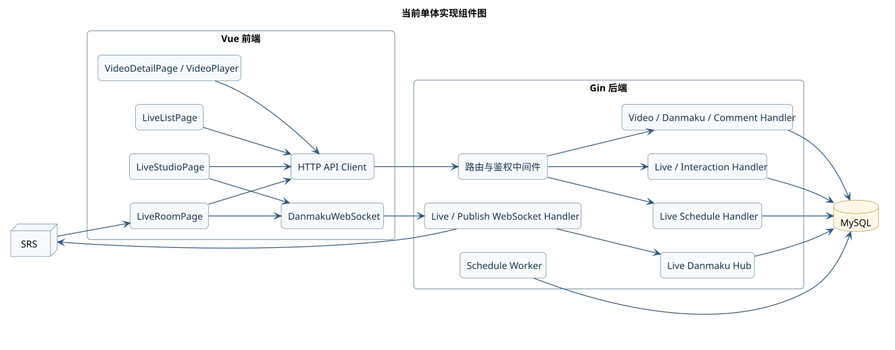
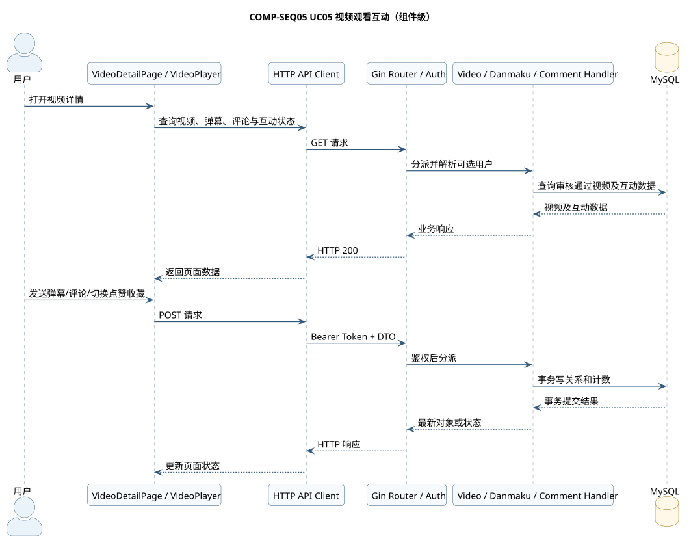
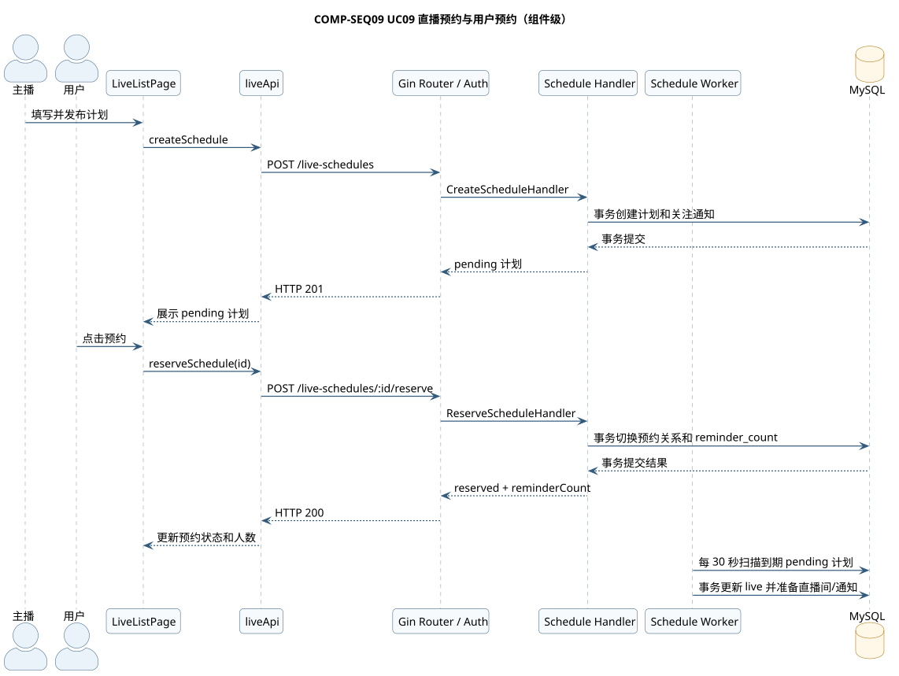
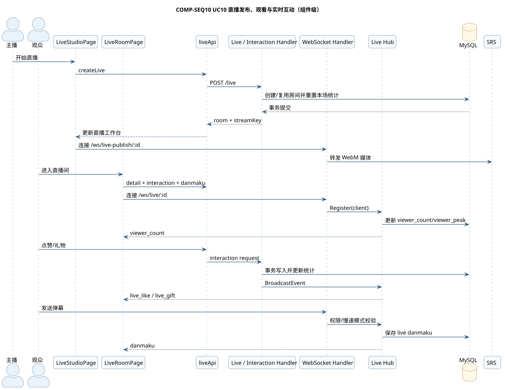

# 互动与直播域概要设计说明书（成员 D）

## 1. 设计范围

本文给出 UC05、UC09、UC10 的组件设计。当前系统采用 Vue 前端、Gin 单体后端、MySQL 和 SRS；计划中的 `engagement-service` 拆分不在当前运行基线中。

## 2. 组件图

源文件：[COMPONENT-D.puml](../models/component/COMPONENT-D.puml)；PNG：[COMPONENT-D.png](../models/component/COMPONENT-D.png)。

## 3. UC05 组件级设计

### 3.1 组件级顺序图

源文件：[COMP-SEQ05.puml](../models/component/COMP-SEQ05.puml)；PNG：[COMP-SEQ05.png](../models/component/COMP-SEQ05.png)。

## 4. UC09 组件级设计

### 4.1 组件级顺序图

源文件：[COMP-SEQ09.puml](../models/component/COMP-SEQ09.puml)；PNG：[COMP-SEQ09.png](../models/component/COMP-SEQ09.png)。

## 5. UC10 组件级设计

### 5.1 组件级顺序图

源文件：[COMP-SEQ10.puml](../models/component/COMP-SEQ10.puml)；PNG：[COMP-SEQ10.png](../models/component/COMP-SEQ10.png)。

## 6. 接口与数据边界

| 用例 | HTTP/WS 边界 | 主要数据 |
| --- | --- | --- |
| UC05 | `/danmaku/*`、`/comments/*`、`/videos/:id/like`、`/videos/:id/collect` | Video、Danmaku、Comment、Like、Collect、CommentLike |
| UC09 | `/live-schedules`、`/live-schedules/:id`、`/live-schedules/:id/reserve` | LiveSchedule、LiveReservation、Notification、LiveRoom |
| UC10 | `/live/*`、`/ws/live/:id`、`/ws/live-publish/:id` | LiveRoom、LiveLike、LiveGift、Danmaku、Follow、CreatorSubscription |

## 7. 关键设计决定

- HTTP 负责可重试的查询和事务写操作，WebSocket 负责房间实时事件。
- 预约关系、点赞关系使用用户和目标的联合唯一约束，避免产生重复有效记录。
- 房间 Hub 对已登录观众按用户编号去重，匿名观众按连接计数；监控连接显式排除。
- 媒体流与业务事件分离：SRS 处理播放媒体，Gin/Hub 处理身份、互动和统计。
- 实时弹幕采用“成功持久化后广播”；数据库写入失败时发送 `chat_error`，不产生房间广播。
