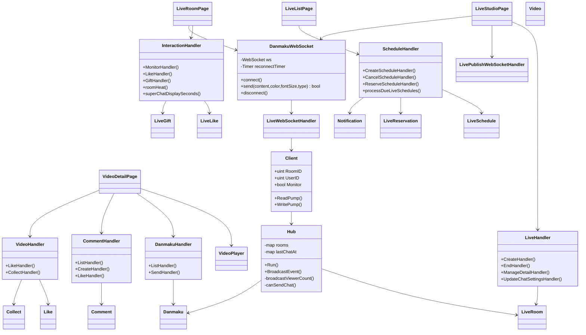
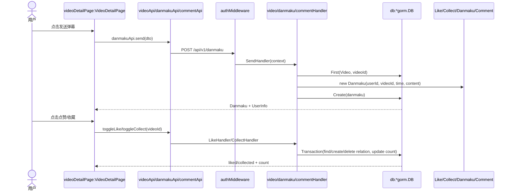
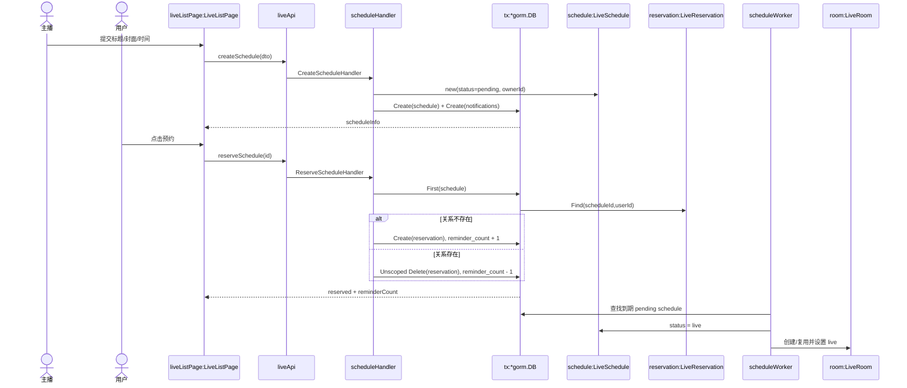
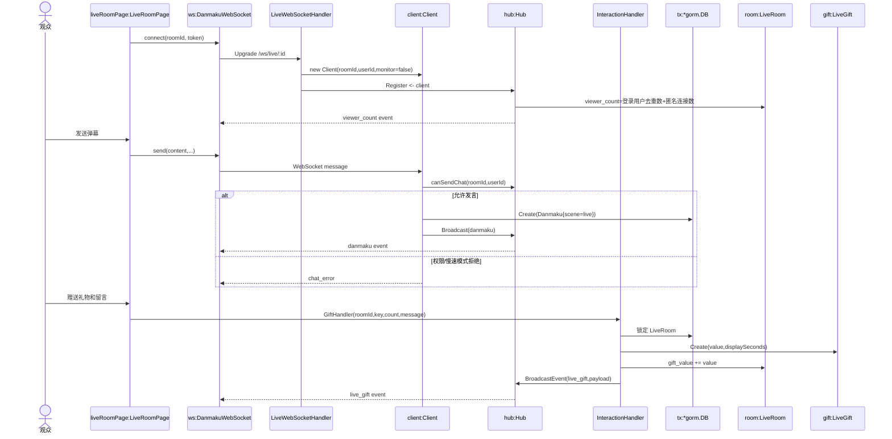

# 互动与直播域详细设计说明书（成员 D）

## 1. 实现类图



## 2. UC05 对象级设计

### 2.1 对象级顺序图



### 2.2 事务与约束

- `Like(user_id, video_id)`、`Collect(user_id, video_id)` 和 `CommentLike(user_id, comment_id)` 应以联合唯一约束代表唯一有效关系。
- 关系切换与聚合计数必须在同一事务中完成；接口返回事务提交后的状态。
- 视频弹幕使用 `scene=video`，直播弹幕使用 `scene=live`，避免同一表中的场景混淆。

## 3. UC09 对象级设计

### 3.1 对象级顺序图



### 3.2 事务与并发

- `LiveReservation(schedule_id, user_id)` 使用联合唯一索引，数据库拒绝重复有效关系。
- 预约关系与 `reminder_count` 在同一事务更新；减计数附带 `reminder_count > 0` 条件。
- 计划任务每 30 秒扫描至多 20 条到期计划；状态更新使用 `WHERE status='pending'` 防止重复启动。
- 创建直播计划时先以 `FOR UPDATE` 锁定主播用户行，再检查同一主播、相同开播时间的 `pending` 计划；发现冲突返回 HTTP 409。该锁使同一主播的并发创建请求串行执行。

## 4. UC10 对象级设计

### 4.1 对象级顺序图



### 4.2 关键算法

```text
giftValue = giftUnitValue[giftKey] * count
heat = viewerCount * 10 + likeCount * 2 + accumulatedGiftValue
displaySeconds(value):
  >=1000 => 120; >=500 => 90; >=200 => 60; >=50 => 30; otherwise => 15
```

### 4.3 连接、权限与故障处理

- 客户端收到 `onclose` 后，若非主动断开，则 3 秒后重新连接。
- 服务端读限制 512 字节，Pong 等待 60 秒，约 54 秒发送一次 Ping；超时连接进入注销流程。
- `monitor=1` 只允许直播间房主连接，且不计入 `viewer_count`。
- `chat_mode=followers` 查询关注关系；`members` 查询未过期的有效会员关系；主播绕过该限制。
- 慢速模式以 `roomId + userId` 记录最近发送时间，主播不受限制。
- 在线人数对已登录 Client 按 `UserID` 去重，匿名 Client 按连接计数，`Monitor=true` 的连接不计入。
- `saveDanmaku` 返回错误时，`ReadPump` 记录错误并向发送者发送 `chat_error`，随后跳过广播；只有持久化成功的弹幕才进入房间广播队列。

## 5. 数据一致性与错误映射

| 操作 | 一致性边界 | 失败结果 |
| --- | --- | --- |
| 视频点赞/收藏 | 关系和计数同一事务 | 回滚并返回失败，不更新页面成功态 |
| 创建直播计划 | 计划和关注通知同一事务 | 任一写失败则全部回滚 |
| 切换直播预约 | 预约关系和提醒数同一事务 | 回滚并保持原状态 |
| 直播点赞 | 锁定直播间，关系切换和统计同一事务 | 不广播事件 |
| 直播礼物/SC | 锁定直播间，礼物记录和累计价值同一事务 | 不广播事件 |
| 实时弹幕 | 先写 MySQL 后广播 | 写失败时返回 `chat_error` 并跳过广播 |

## 6. 待拆分服务边界

未来的 `engagement-service` 可承接弹幕、评论、点赞、收藏、直播预约、直播互动和房间 Hub。拆分时必须通过内部 API 获取用户、视频、关注及会员状态，并为超时定义降级策略；在该拆分落地前，本文所有类名和调用均以当前单体代码为准。
