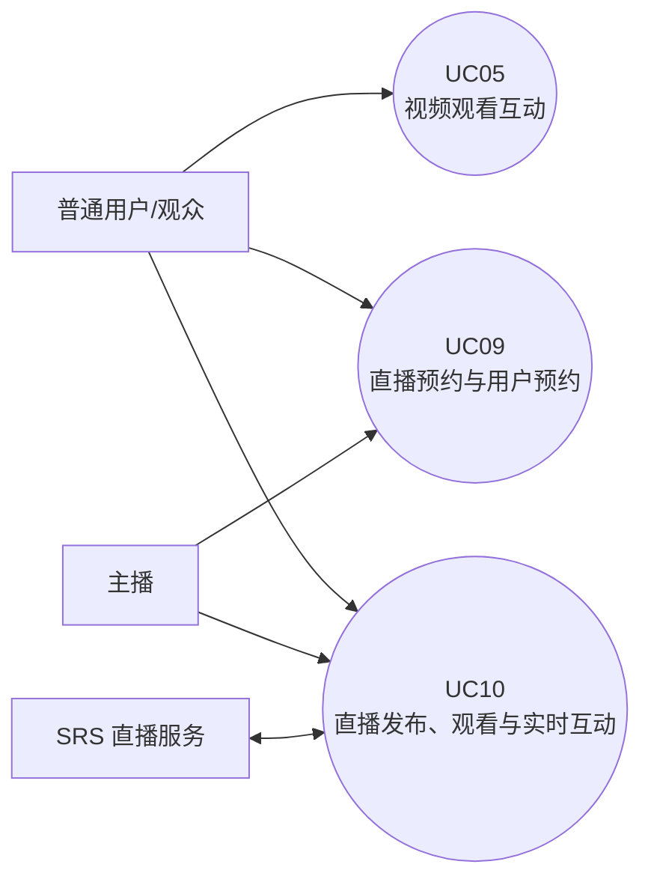
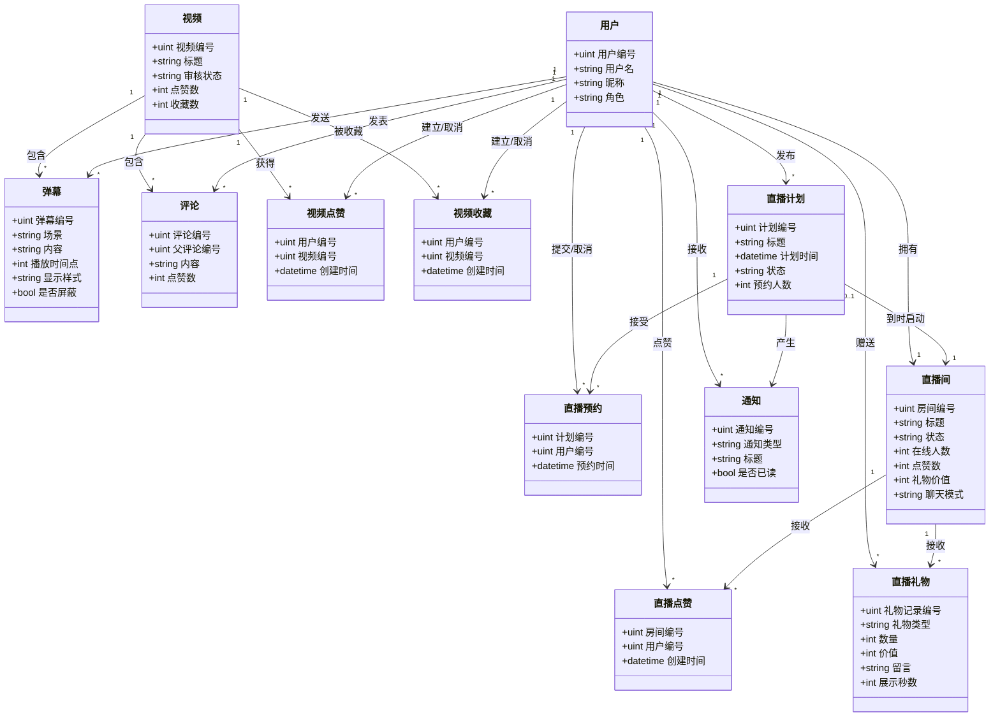
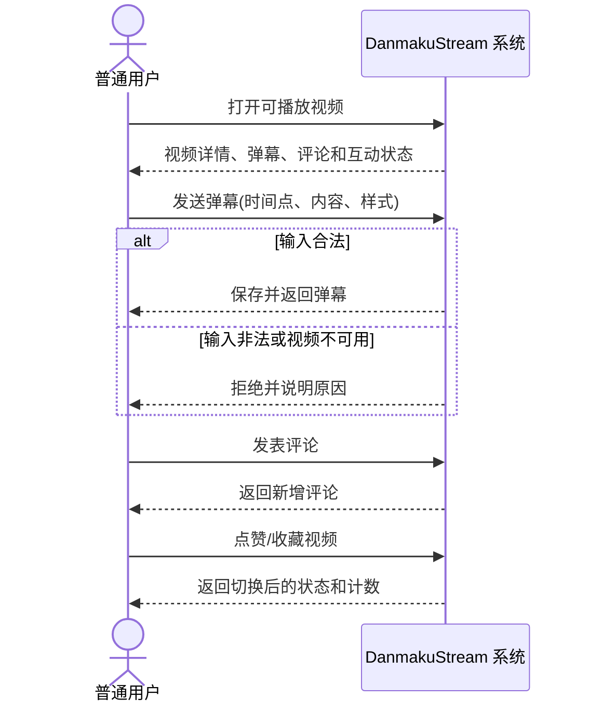
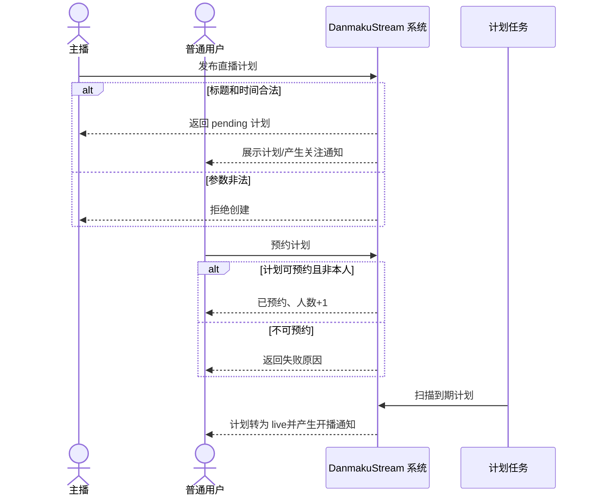
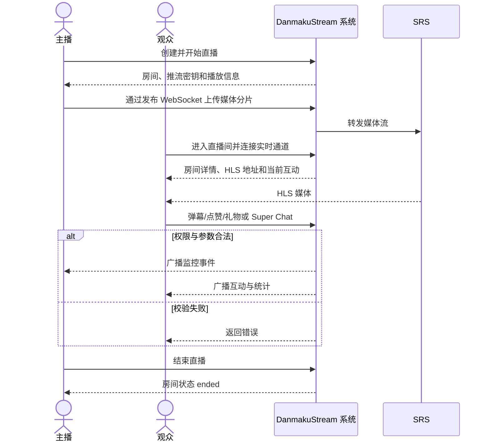

# 互动与直播域需求说明书（成员 D）

## 1. 范围

本文档覆盖最终业务场景清单中的三个用例：

- UC05 视频观看互动；
- UC09 直播预约与用户预约；
- UC10 直播发布、观看与实时互动。

直播回放不在本范围内。系统当前仍存在回放相关代码，但不作为本文档的需求、设计和验收对象。

## 2. 用户故事与需求

| 需求 | 用户故事 | 验收要点 |
| --- | --- | --- |
| REQ-D-01 | 作为观众，我希望在观看视频时发送弹幕、评论并点赞或收藏，以便参与内容互动。 | 互动被持久化；刷新后状态一致；非法输入被拒绝；点赞和收藏可取消。 |
| REQ-D-02 | 作为主播，我希望发布未来的开播计划，以便观众提前了解直播安排。 | 标题和未来时间合法时创建成功；计划可展示、取消并按时转为直播。 |
| REQ-D-03 | 作为观众，我希望预约或取消预约一场直播，以便管理开播提醒。 | 同一用户与计划仅有一条有效预约；人数与预约关系一致；不能预约自己的直播。 |
| REQ-D-04 | 作为主播，我希望通过直播工作台创建、发布和结束直播，以便完成一次实时直播。 | 只有房主可管理；系统生成推流凭据；直播状态可查询；结束后状态更新。 |
| REQ-D-05 | 作为观众，我希望进入直播间观看并实时发送弹幕、点赞、礼物或 Super Chat。 | 互动实时广播并持久化；礼物规则正确；聊天权限与慢速模式生效。 |
| REQ-D-06 | 作为主播，我希望看到在线人数、热度和互动监控，以便了解直播状态。 | 监控连接不计入观众数；点赞、礼物与在线人数变化实时可见；热度计算一致。 |
| REQ-D-07 | 作为直播参与者，我希望网络短暂中断后自动恢复连接，以便继续互动。 | 观看端 WebSocket 断开后 3 秒重连；心跳清理失效连接；重新连接后恢复接收事件。 |

## 3. 用例图

## 4. 概念类图

图中的属性是业务层面的核心信息，不表示数据库字段必须与其逐字对应；概念类图不包含接口方法、Handler 或表索引等实现细节。

## 5. UC05 视频观看互动

### 5.1 用例说明

- 参与者：普通用户。
- 触发条件：已登录用户观看审核通过的视频并发起互动。
- 前置条件：用户已登录；目标视频存在且可播放。
- 主成功流程：
  1. 用户进入视频详情页，系统返回视频、弹幕和评论。
  2. 用户在播放时间点发送弹幕，系统校验并保存弹幕。
  3. 用户发表评论，系统保存评论并返回作者信息。
  4. 用户点赞或收藏视频，系统建立关系并更新计数。
  5. 页面显示最新互动状态，刷新后仍与服务端一致。
- 备选或异常流程：用户再次点赞或收藏时取消关系；空内容、非法参数或不可播放视频被拒绝；屏蔽弹幕不公开展示；数据库操作失败时不返回成功结果。
- 可验证结果：弹幕、评论、点赞和收藏关系可从接口或数据库验证，页面状态与统计一致。

### 5.2 系统级顺序图

## 6. UC09 直播预约与用户预约

### 6.1 用例说明

- 参与者：主播、普通用户、计划任务。
- 触发条件：主播发布未来直播计划，或用户切换预约状态。
- 前置条件：参与者已登录；预约时间不早于当前时间。
- 主成功流程：
  1. 主播填写标题、封面和计划时间并发布。
  2. 系统保存 `pending` 计划并通知主播的关注者。
  3. 用户浏览待开始计划并提交预约。
  4. 系统在事务中创建唯一预约关系并增加提醒人数。
  5. 用户再次操作时取消预约并减少提醒人数。
  6. 到达计划时间后，后台任务将计划转为 `live` 并启动或复用主播直播间。
- 备选或异常流程：标题为空、时间格式错误或早于当前时间时拒绝创建；同一主播已有相同开播时间的 `pending` 计划时返回冲突；不能预约自己的计划；非 `pending` 计划不能预约；只有房主或管理员可取消计划；不存在的计划返回失败。
- 可验证结果：计划状态、预约关系、提醒人数与直播间启动状态一致。

> 当前数据模型没有预计直播时长，因此冲突口径定义为“同一主播、相同开播时间、状态为 `pending`”。创建时锁定主播用户行，避免并发请求同时通过冲突检查。

### 6.2 系统级顺序图

## 7. UC10 直播发布、观看与实时互动

### 7.1 用例说明

- 参与者：主播、普通用户、SRS 直播服务。
- 触发条件：主播开始直播，或观众进入直播间。
- 前置条件：用户已登录；主播拥有直播间；SRS 可用。
- 主成功流程：
  1. 主播在工作台配置标题、封面和聊天规则并创建直播。
  2. 系统生成推流密钥，将房间状态设置为 `live`。
  3. 主播通过发布 WebSocket 向 SRS 推送 WebM 流。
  4. 观众打开直播间播放 HLS，并建立房间 WebSocket。
  5. 观众发送弹幕、切换点赞、赠送礼物或携带留言的 Super Chat。
  6. 系统持久化互动并广播在线人数、点赞、礼物和弹幕事件。
  7. 主播在监控连接中查看互动数据并结束直播。
- 备选或异常流程：非房主不能进入监控、修改规则或结束直播；未登录用户可连接观看但不能发送弹幕及需鉴权的互动；聊天模式和慢速模式拒绝不合规发言；非法礼物、数量或留言被拒绝；观看 WebSocket 断开后每 3 秒重连；推流或 SRS 不可用时播放端显示等待/错误。
- 可验证结果：房间状态、媒体播放、在线人数、点赞数、礼物值、热度和实时事件一致；下播后状态变为 `ended`。

### 7.2 业务规则

- 礼物：鲜花 `10`、星光 `50`、火箭 `200`；单次数量为 `1..99`。
- 礼物留言最多 200 字；有留言的礼物作为 Super Chat 展示。
- Super Chat 展示时长：价值 `<50` 为 15 秒，`50..199` 为 30 秒，`200..499` 为 60 秒，`500..999` 为 90 秒，`>=1000` 为 120 秒。
- 热度：`在线人数 × 10 + 点赞数 × 2 + 礼物价值`。
- 支持榜按用户累计礼物价值和数量降序取前 10。
- 聊天模式为所有人、关注者或付费会员；主播不受聊天身份和慢速模式限制。
- 已登录观众按用户编号去重计入在线人数；匿名观众没有稳定身份，按连接计数；主播监控连接不计入。
- 实时弹幕必须先成功写入 MySQL 再广播；写入失败时只向发送者返回 `chat_error`。

### 7.3 系统级顺序图

## 8. 非功能需求与边界

- 一致性：关系记录与计数更新应在同一事务完成，失败时整体回滚。
- 实时性：房间事件通过 WebSocket 广播；客户端断线后自动重连。
- 安全性：主播管理接口、预约及互动写接口必须鉴权；对象级权限由后端校验。
- 可追溯性：所有本文需求均在《追溯表》中对应到用例、设计章节、代码与测试。
- 边界：实际支付结算、直播回放、CDN 运维及 engagement-service 拆分部署不属于当前验收实现。
