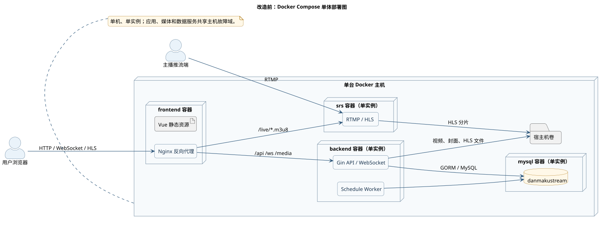
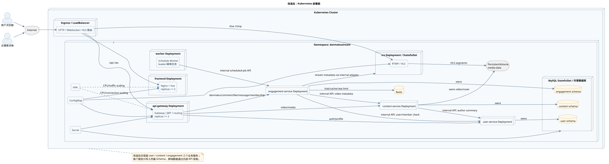

# DanmakuStream 部署设计说明

## 1. 改造前：Docker Compose 单体部署

当前运行基线由单台 Docker 主机承载前端 Nginx、Gin 单体后端、SRS 和 MySQL。应用实例、媒体处理和数据库处于同一主机故障域。

源文件：[DEPLOY-MONO.puml](models/deployment/DEPLOY-MONO.puml)；PNG：[DEPLOY-MONO.png](models/deployment/DEPLOY-MONO.png)。

## 2. 改造后：Kubernetes 部署

改造后通过 Ingress/LoadBalancer 统一接入，前端和后端使用 Deployment 多副本，计划任务独立运行，持久化数据使用 StatefulSet、托管数据库或 PersistentVolume，并通过 ConfigMap、Secret 和 HPA 管理配置、凭据和扩缩容。

源文件：[DEPLOY-K8S.puml](models/deployment/DEPLOY-K8S.puml)；PNG：[DEPLOY-K8S.png](models/deployment/DEPLOY-K8S.png)。
