# 成员 B：四个用例顺序图

## UC001 用户注册、登录与资料维护

### 需求说明书：系统级顺序图

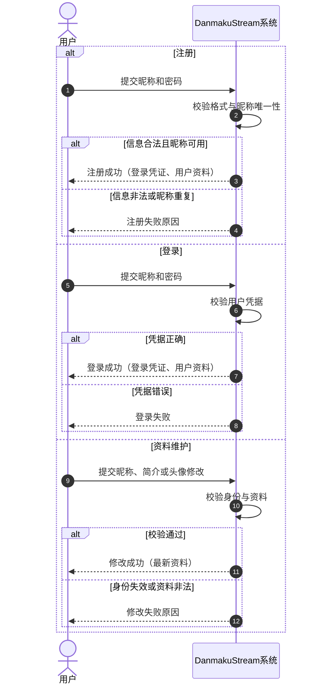

### 概要设计说明书：组件级顺序图

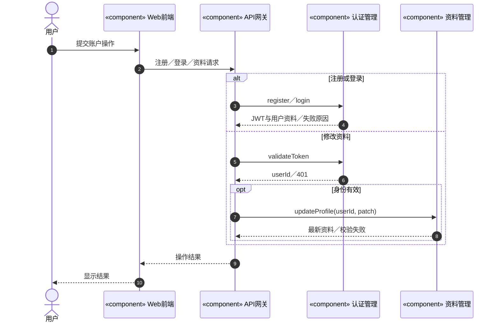

### 详细设计说明书：对象级顺序图

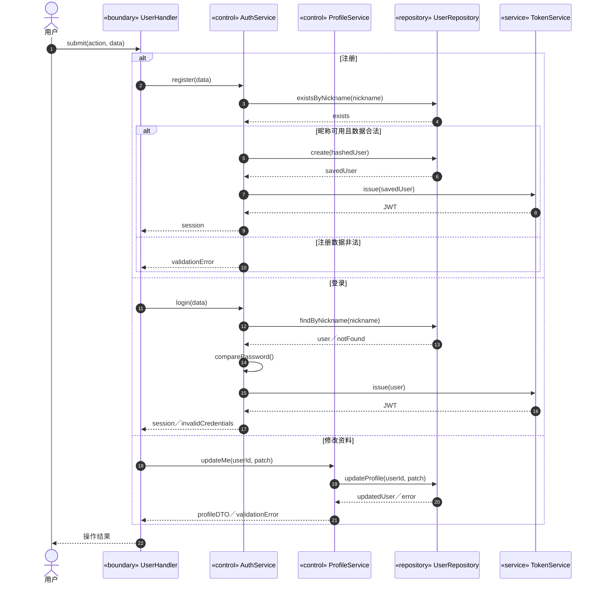

## UC007 关注关系、分组、屏蔽与内容通知

### 需求说明书：系统级顺序图

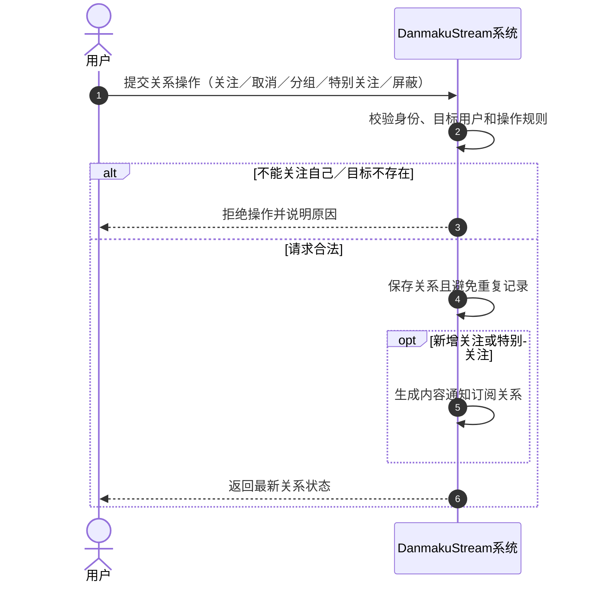

### 概要设计说明书：组件级顺序图

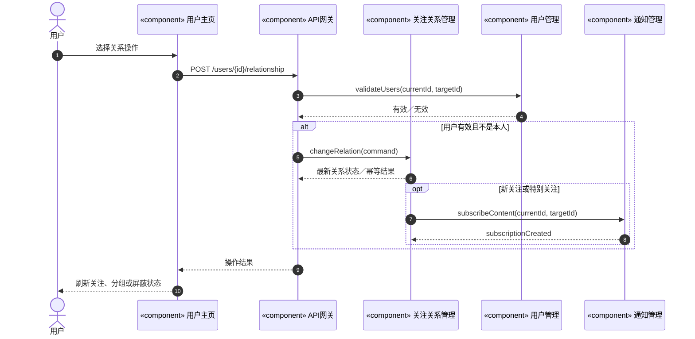

### 详细设计说明书：对象级顺序图

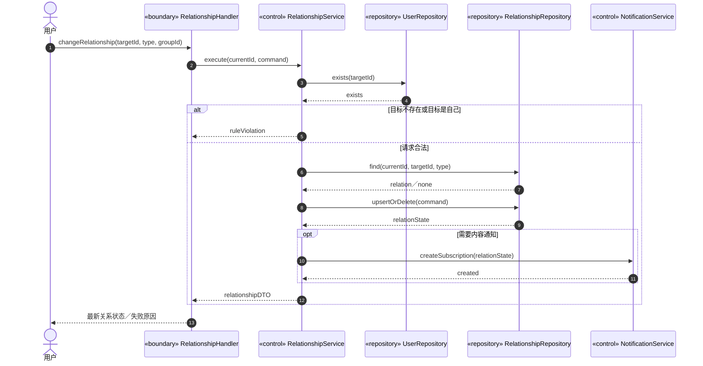

## UC008 创作者会员订阅

### 需求说明书：系统级顺序图

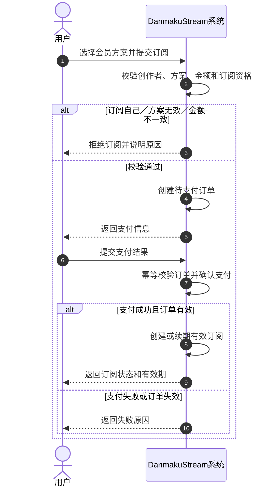

### 概要设计说明书：组件级顺序图

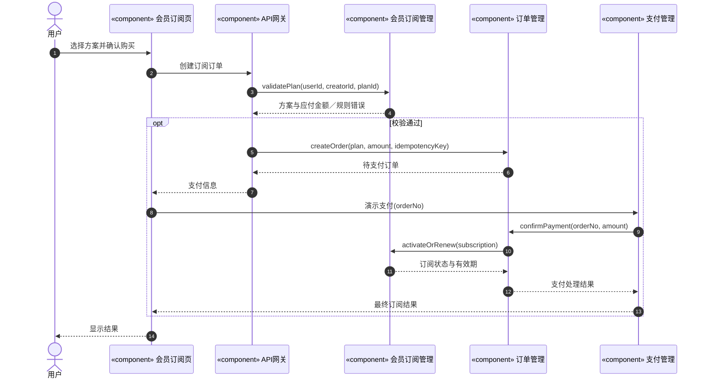

### 详细设计说明书：对象级顺序图

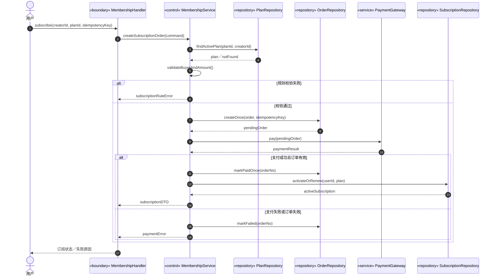

## UC011 用户私信与媒体分享

### 需求说明书：系统级顺序图

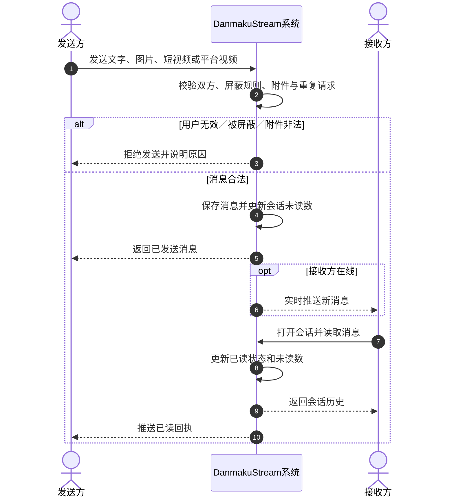

### 概要设计说明书：组件级顺序图

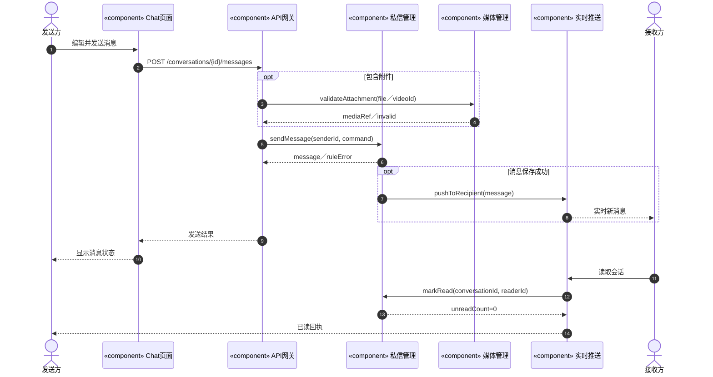

### 详细设计说明书：对象级顺序图

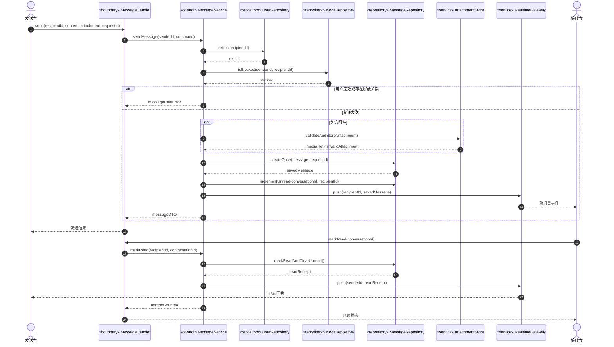
