# 用户 B：UC001 用户注册、登录与资料维护

## 1. 任务范围

本交付对应 GitHub Issue `#31`，覆盖以下业务能力：

- 用户注册：昵称、密码校验，创建账号并返回登录会话。
- 用户登录：昵称/密码认证，签发 JWT。
- 资料维护：查询当前用户资料，修改昵称、简介和头像。
- 异常流程：昵称重复、密码错误、未登录、JWT 过期、非法资料。
- user-service 拆分方案、独立用户 Schema、单元/API/E2E 测试设计。

当前仓库已有实现入口：

| 能力 | 前端 | API | 后端实现 |
| --- | --- | --- | --- |
| 注册 | `/register` | `POST /api/v1/auth/register` | `internal/logic/auth/auth_logic.go` |
| 登录 | `/login` | `POST /api/v1/auth/login` | `internal/logic/auth/auth_logic.go` |
| 当前资料 | Pinia `fetchUserInfo` | `GET /api/v1/auth/me` | `MeHandler` |
| 修改资料 | 个人中心 | `PUT /api/v1/users/me` | `UpdateMeHandler` |
| 上传头像 | 个人中心 | `POST /api/v1/users/me/avatar` | `UploadAvatarHandler` |

## 2. 需求与异常流程补充

### 2.1 正常流程

1. 未登录用户提交昵称和密码。
2. 系统校验格式、查询昵称唯一性。
3. 密码使用 bcrypt 哈希后写入用户表。
4. 系统生成包含 `userId`、`role`、`iat`、`exp` 的 JWT。
5. 前端保存 token 和安全用户信息，不保存明文密码。
6. 登录后可查询和修改自己的资料；修改成功后刷新本地用户信息。

### 2.2 异常流程与验收规则

| 编号 | 场景 | 处理规则 | HTTP/业务结果 |
| --- | --- | --- | --- |
| E01 | 昵称为空或超长 | 去除首尾空格；长度不在 1~50 字符时拒绝 | `400`，提示资料格式错误 |
| E02 | 密码为空或不符合策略 | 密码长度 8~72；注册和修改密码时统一校验 | `400` |
| E03 | 昵称重复 | 数据库唯一索引兜底；并发注册也必须返回可识别错误 | `409`，不创建重复用户 |
| E04 | 昵称/密码错误 | 不区分“昵称不存在”和“密码错误”，避免泄露账号存在性 | `401` |
| E05 | 未携带 JWT | 受保护接口在中间件拦截 | `401` |
| E06 | JWT 过期或签名错误 | 拒绝请求；前端清除 token 并跳转登录页 | `401` |
| E07 | 修改他人资料 | 资料接口只使用 JWT 中的当前用户 ID，不接受客户端 userId | `403` 或无法访问 |
| E08 | 非法昵称/简介 | 拒绝控制字符、超长内容和纯空白内容；输出时进行 HTML 转义 | `400` |
| E09 | 非法头像 | 限制 MIME、扩展名、大小和图片解码结果；服务端生成文件名 | `400` |
| E10 | 用户不存在/已删除 | JWT 通过但数据库查不到用户时拒绝访问 | `401`，前端退出登录 |

## 3. 系统级设计

### 3.1 UC001 系统顺序图

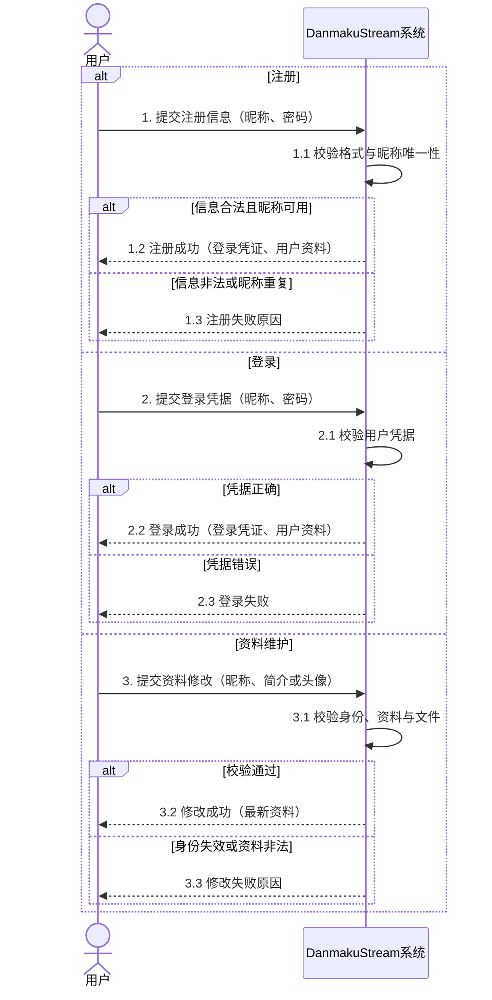

> 系统顺序图将 DanmakuStream 视为黑盒，只表达参与者与系统之间的系统事件；Web、API、数据库等内部对象放到组件级和对象级顺序图中。

### 3.2 系统状态图

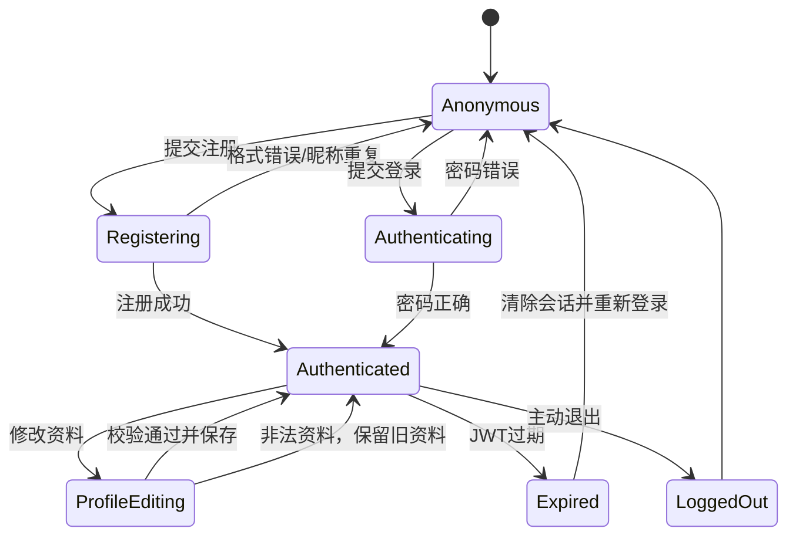

### 3.3 系统活动图

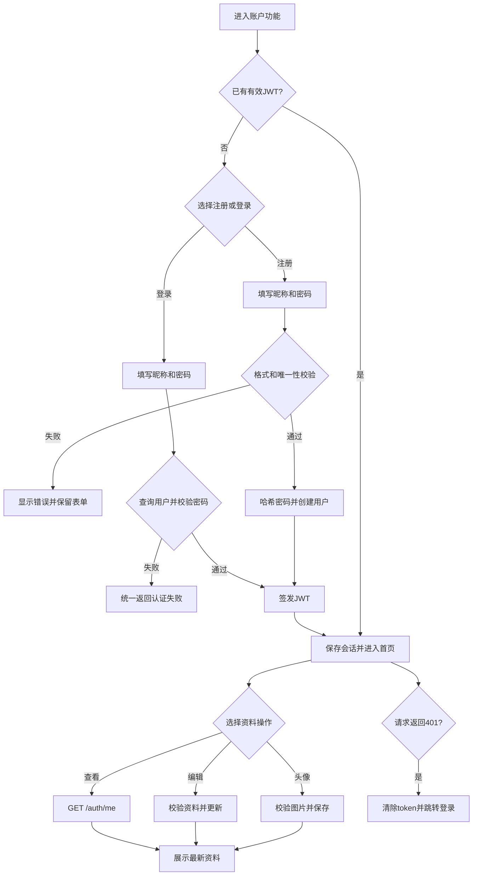

## 4. 概要设计：user-service 拆分

### 4.1 组件图

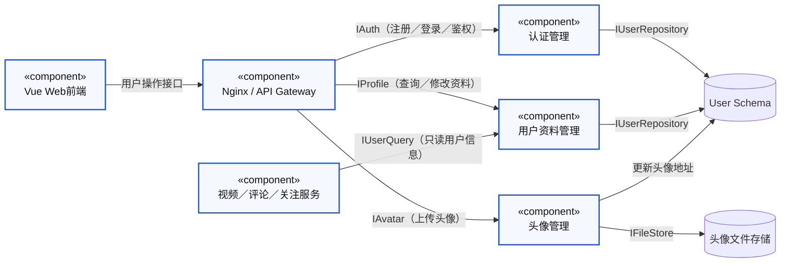

拆分边界：认证、用户资料和头像归 user-service；视频、评论、直播等服务只通过 `userId` 和内部只读用户接口获取用户信息，不直接写入用户表。阶段一可保留现有 Go 单体进程，采用 package/module 边界；阶段二再独立部署服务。

### 4.2 组件顺序图：登录与资料更新

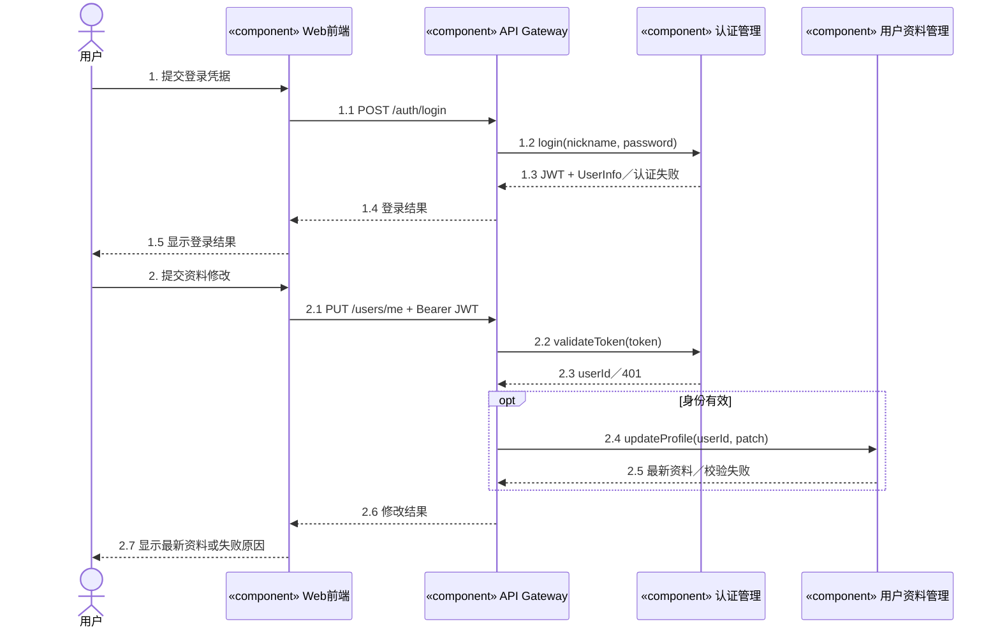

### 4.3 组件状态图

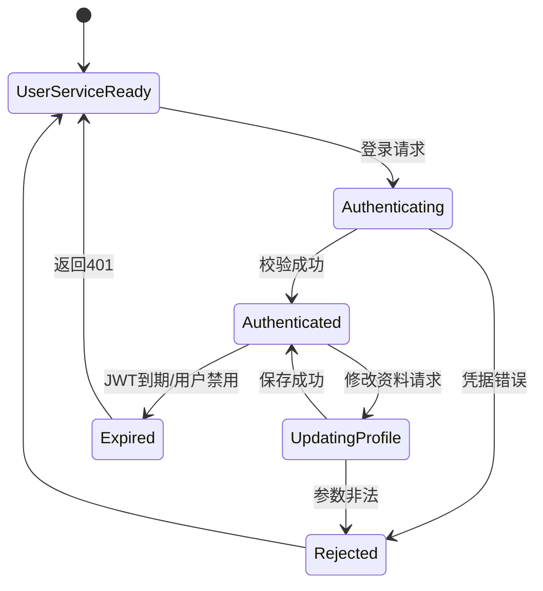

### 4.4 组件活动图

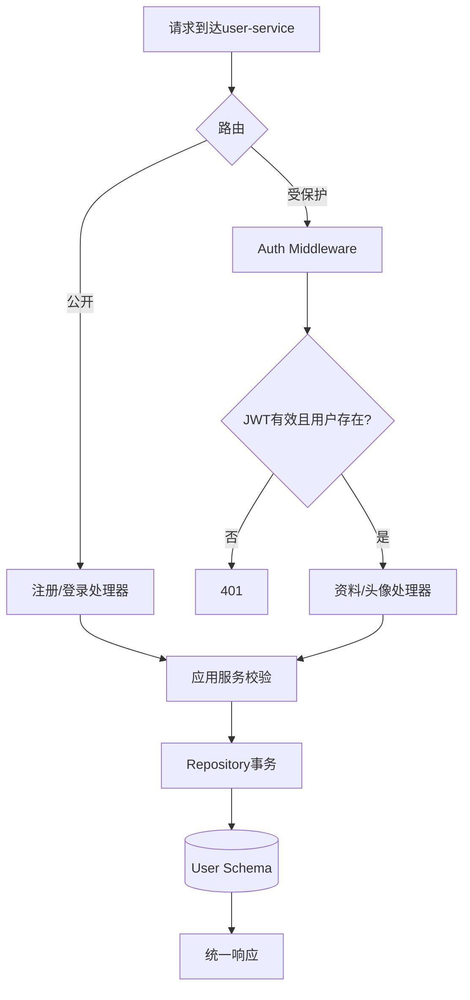

## 5. 详细设计

### 5.1 类图

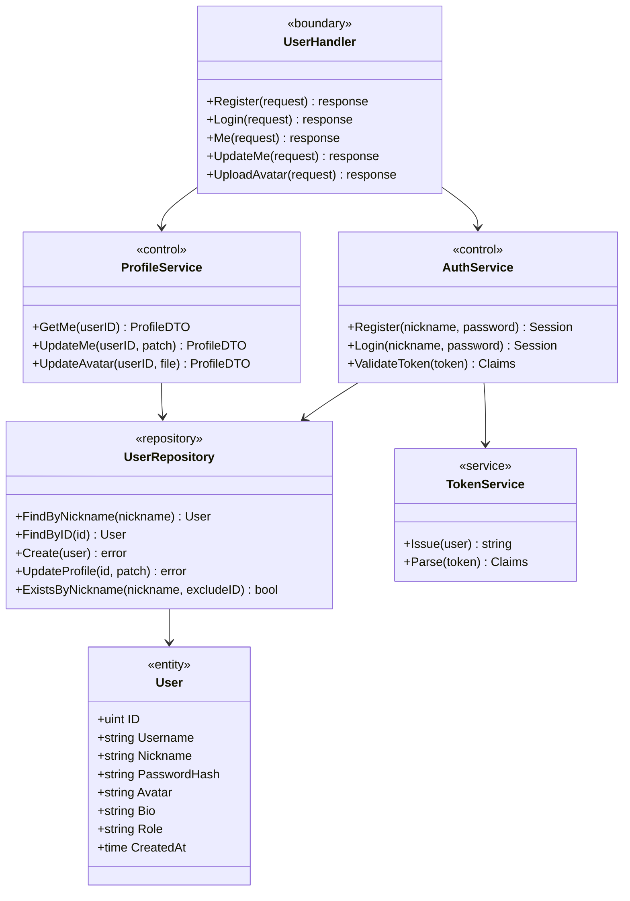

### 5.2 注册对象顺序图

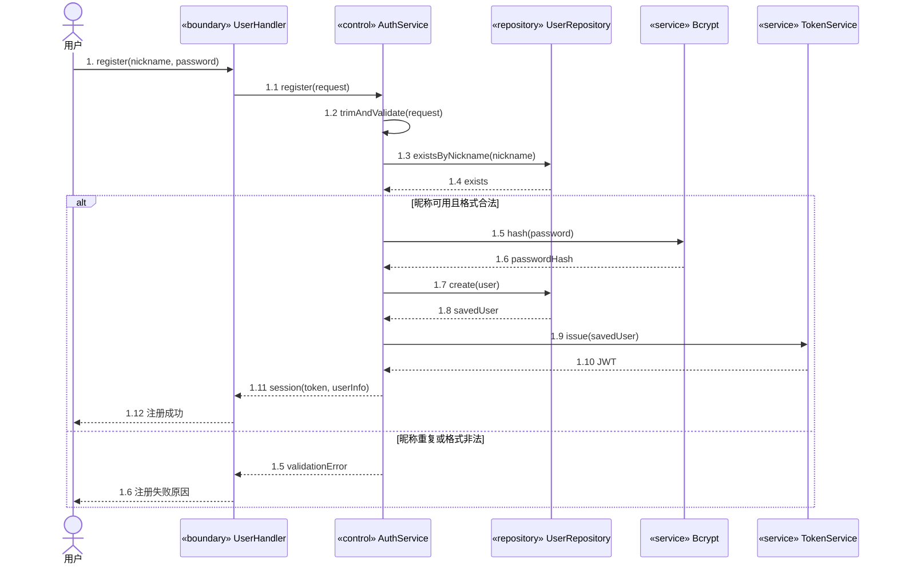

### 5.3 登录对象顺序图

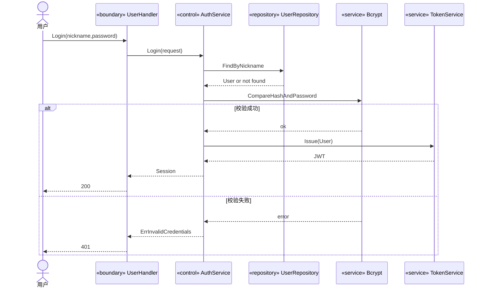

### 5.4 资料维护对象顺序图

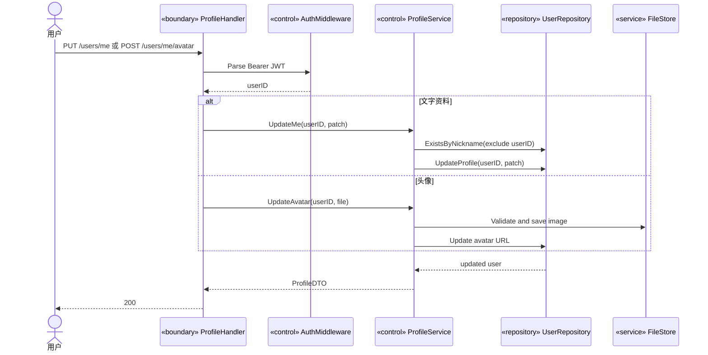

### 5.5 资料维护状态图

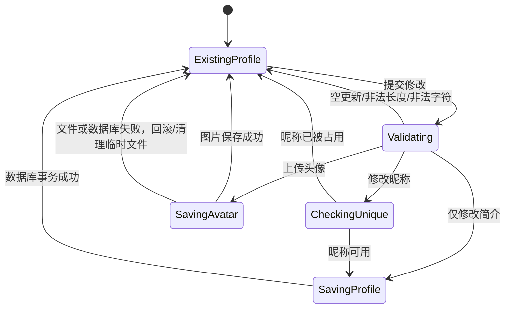

## 6. 独立 User Schema

```sql
CREATE TABLE users (
  id BIGINT UNSIGNED PRIMARY KEY AUTO_INCREMENT,
  username VARCHAR(50) NOT NULL UNIQUE,
  nickname VARCHAR(50) NOT NULL UNIQUE,
  password_hash VARCHAR(255) NOT NULL,
  avatar_url VARCHAR(500) NOT NULL DEFAULT '',
  bio VARCHAR(500) NOT NULL DEFAULT '',
  role VARCHAR(20) NOT NULL DEFAULT 'user',
  status VARCHAR(20) NOT NULL DEFAULT 'active',
  token_version INT NOT NULL DEFAULT 0,
  created_at TIMESTAMP NOT NULL DEFAULT CURRENT_TIMESTAMP,
  updated_at TIMESTAMP NOT NULL DEFAULT CURRENT_TIMESTAMP ON UPDATE CURRENT_TIMESTAMP,
  deleted_at TIMESTAMP NULL,
  INDEX idx_users_status (status),
  INDEX idx_users_created_at (created_at)
);
```

约束与迁移原则：

- `password_hash` 只能存 bcrypt/同等强度哈希，禁止明文密码。
- `nickname` 和 `username` 使用数据库唯一索引，应用层检查只用于友好提示。
- 其他服务只保存 `author_id/user_id`，通过内部 API 获取脱敏 `UserInfo`。
- 删除用户采用软删除；JWT 校验后再次检查 `status` 和 `deleted_at`。
- 头像文件名由服务端生成，文件内容放对象存储或独立 volume，数据库只保存 URL。

## 7. 测试设计

### 7.1 单元测试

| 编号 | 测试对象 | 场景 | 期望 |
| --- | --- | --- | --- |
| UT-01 | 注册校验 | 正常昵称+密码 | 返回规范化输入 |
| UT-02 | 注册校验 | 空白/超长/控制字符 | 返回参数错误 |
| UT-03 | 注册服务 | 昵称重复 | 返回 `ErrNicknameExists` |
| UT-04 | 注册服务 | bcrypt 哈希 | 数据库不出现明文密码 |
| UT-05 | 登录服务 | 正确密码 | 返回 JWT，`exp` 存在 |
| UT-06 | 登录服务 | 错误密码/不存在用户 | 返回同一认证错误 |
| UT-07 | TokenService | 过期、错误签名、错误算法 | 全部拒绝 |
| UT-08 | 资料服务 | 修改自己的昵称/简介 | 成功且不修改 ID/角色 |
| UT-09 | 资料服务 | 修改为他人昵称 | 返回冲突 |
| UT-10 | 头像服务 | 非图片、超大文件、非法 MIME | 拒绝且不产生脏文件 |

### 7.2 API 测试

| 编号 | 请求 | 断言 |
| --- | --- | --- |
| API-01 | `POST /auth/register` | `200/201`、返回 token，不返回 password |
| API-02 | 重复注册 | `409`，用户数量不增加 |
| API-03 | `POST /auth/login` 正确密码 | `200`，token 可调用 `/auth/me` |
| API-04 | 登录错误密码 | `401`，错误信息不泄露账号存在性 |
| API-05 | 无 Authorization 调 `/auth/me` | `401` |
| API-06 | 过期 JWT 调 `/users/me` | `401` |
| API-07 | 修改昵称/简介 | `200`，再次查询值一致 |
| API-08 | 非法资料 | `400`，旧资料保持不变 |
| API-09 | 上传合法头像 | `200`，返回可访问 URL |
| API-10 | 上传伪造扩展名 | `400`，无文件残留 |

### 7.3 E2E 主链路

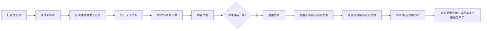

E2E 验收数据至少包含：一个正常用户、一个重复昵称、一个错误密码、一个过期 JWT、一个非法头像文件和一个超长简介。

## 8. 需求-设计-代码-测试追溯表

| 需求编号 | 需求/验收点 | 设计依据 | 当前代码/目标模块 | 测试 |
| --- | --- | --- | --- | --- |
| UC001-R01 | 用户可注册 | 系统顺序图、注册对象图 | `auth_logic.Register` | UT-01~04, API-01~02, E2E |
| UC001-R02 | 昵称必须唯一 | 异常 E03、User Schema 唯一索引 | `users.nickname` | UT-03/09, API-02 |
| UC001-R03 | 用户可登录 | 系统顺序图、登录对象图 | `auth_logic.Login` | UT-05/06, API-03~04, E2E |
| UC001-R04 | 密码不可明文存储 | User Schema、AuthService | bcrypt | UT-04 |
| UC001-R05 | 受保护接口需认证 | 系统状态图、组件活动图 | `AuthMiddleware` | UT-07, API-05~06 |
| UC001-R06 | JWT 过期必须失效 | 状态图 Expired | `TokenService`/JWT claims | UT-07, API-06, E2E |
| UC001-R07 | 用户可查看自己的资料 | 资料对象图 | `MeHandler` | API-05, E2E |
| UC001-R08 | 用户可修改昵称和简介 | ProfileService 类图/状态图 | `UpdateMeHandler` | UT-08/09, API-07~08 |
| UC001-R09 | 用户可更新头像 | 资料对象图、头像组件 | `UploadAvatarHandler` | UT-10, API-09~10, E2E |
| UC001-R10 | 非法资料不得落库 | 异常 E01/E02/E08/E09 | DTO 校验器/Repository 事务 | UT-02/10, API-08/10 |

## 9. 当前实现差距与建议提交拆分

当前代码已具备基础注册、登录、JWT 和资料接口，但建议在实现分支补齐：

1. 将重复昵称从“先 Count 再 Create”升级为唯一索引错误映射，解决并发注册竞态。
2. `UpdateMeHandler` 对昵称、简介做长度、字符和唯一性校验，并正确区分 `409` 与 `500`。
3. 头像上传增加大小、MIME、图片解码校验和临时文件清理。
4. 为 JWT 增加用户状态/软删除检查，并统一前端 401 处理。
5. 先在现有 Go 单体中建立 `user-service` 内部包边界，再按部署需要拆成独立进程，避免一次性改动影响视频主链路。

建议提交顺序：

- `docs: add UC001 user service design and traceability`
- `feat: harden user validation and auth errors`
- `test: add user service unit api and e2e tests`
